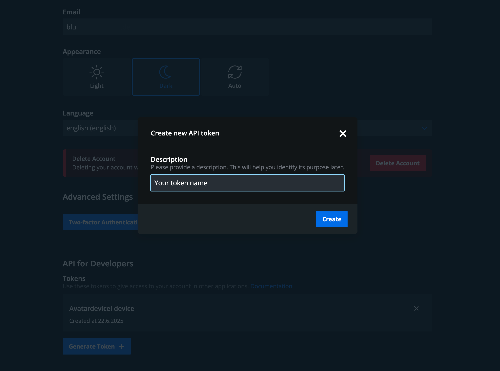

# Authentication

paperlesspaper currently documents two authentication approaches:

- API keys sent in the `x-api-key` request header.
- JWT bearer tokens sent through standard bearer authentication.

If you are getting started, use an API key first. It is the clearest option for server-to-server requests and simple API exploration.

## Get an API key



You can create an API key in your paperlesspaper account at [web.paperlesspaper.de/account](https://web.paperlesspaper.de/account).

There is a request limit of `300` requests per minute for API key usage.

## API keys

Send your API key in the `x-api-key` request header:

```http
x-api-key: <your-api-key>
```

Example request:

```bash
curl https://api.paperlesspaper.de/v1/users/ \
	-H "x-api-key: <your-api-key>"
```

## Error handling

The public developer guide describes these common auth-related responses:

- `401 Unauthorized` when a token is missing, invalid, or expired.
- `403 Forbidden` when the authenticated identity does not have access to the endpoint.

If a request fails, verify these points first:

- The header name is exactly `x-api-key` or `Authorization`.
- The token or key is current and has not been revoked.
- You are calling the correct environment and base URL.
- The endpoint actually supports the authentication method you are using.
