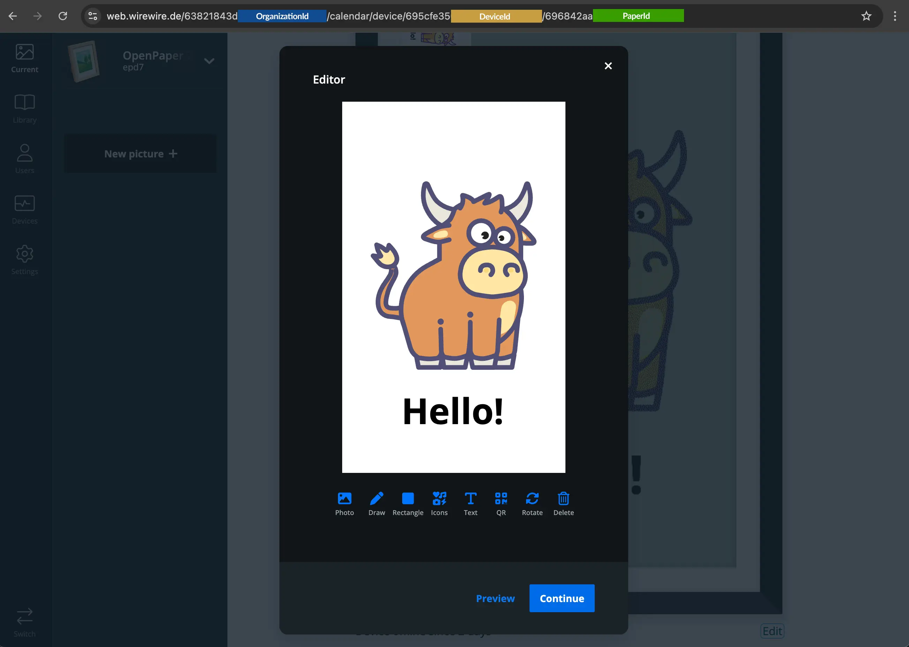

# Updating an Image

Use this endpoint when a paper already exists and you want to replace its image.

This guide focuses on the practical upload flow for `POST /papers/uploadSingleImage/{paperId}`. For the generated endpoint reference, see [API Reference: Upload single image](/api-reference/papers/uploadsingleimage/paperid/post).

## Getting the parameters right

You need a paperID, which is best obtained by the web application when viewing the details of an existing paper.



Make sure to use the correct part of the URL as the paper ID.

## What this endpoint does

The upload endpoint attaches one or more image-related payloads to an existing paper:

Send the request as `multipart/form-data`.

## Authentication

Use the API key flow described in [Authentication](/getting-started/authentication) and send your key in the `x-api-key` header:

- `x-api-key: <your-api-key>`

## Request fields

At minimum, send `picture`.

- `picture`: Source image file.
- `pictureDevice`: Optional processed image file that is already prepared for the target device.
- `pictureEditable`: Optional JSON string with editor data.
- `settings`: Optional JSON string merged into `paper.meta` before the image is processed.

## How the upload behaves

### Upload only the source image

If you send only `picture`, the backend treats it as the source image, prepares it for the device, and updates the paper image.

### Upload the source image and a device-ready image

If you send both `picture` and `pictureDevice`:

- `pictureDevice` is used as the final image sent to the device.
- `picture` is kept as the original reference image for the app and later edits.

This is the preferred flow when your application already performs its own resizing, conversion, or dithering.

### Update paper settings during the upload

If you send `settings`, the backend merges those values into `paper.meta` before handling the image. That lets values such as `lut` or `orientation` affect the upload immediately.

## Example: simple upload

```bash
curl -X POST "https://api.paperlesspaper.de/v1/papers/uploadSingleImage/<paper-id>" \
  -H "x-api-key: <your-api-key>" \
  -F "picture=@/path/to/image.png"
```

This flow typically:

- uploads the image,
- prepares it for the device, and
- updates the paper's image timestamp.

## Example: upload with a device-ready image

```bash
curl -X POST "https://api.paperlesspaper.de/v1/papers/uploadSingleImage/<paper-id>" \
  -H "x-api-key: <your-api-key>" \
  -F "picture=@/path/to/original.png" \
  -F "pictureDevice=@/path/to/device-ready.png"
```

## Example: upload with settings

```bash
curl -X POST "https://api.paperlesspaper.de/v1/papers/uploadSingleImage/<paper-id>" \
  -H "x-api-key: <your-api-key>" \
  -F "picture=@/path/to/image.png" \
  -F 'settings={"lut":"default","orientation":"portrait"}'
```

This behaves like a metadata update followed by the image upload in one request.

## Frontend example

```ts
const formData = new FormData();

formData.append("picture", originalFile);

if (deviceReadyFile) {
  formData.append("pictureDevice", deviceReadyFile);
}

if (editableJson) {
  formData.append("pictureEditable", JSON.stringify(editableJson));
}

if (settings) {
  formData.append("settings", JSON.stringify(settings));
}

await uploadSingleImage({
  id: paperId,
  body: formData,
  deviceId,
});
```

## Common mistakes

- Sending JSON instead of `multipart/form-data`.
- Setting the `Content-Type` header manually when using `FormData`.
- Forgetting to `JSON.stringify(...)` in the `settings` payloads.
