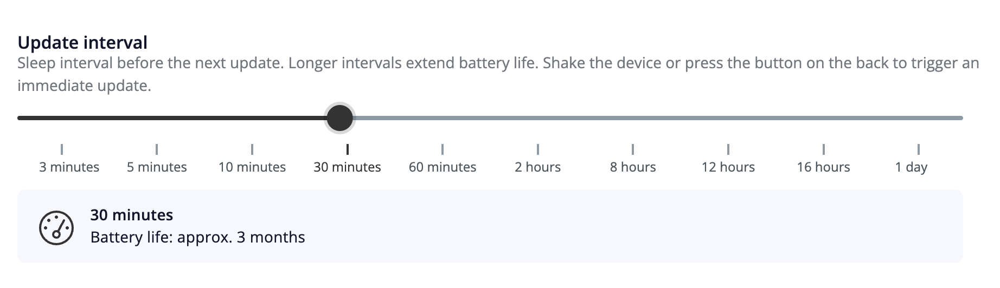
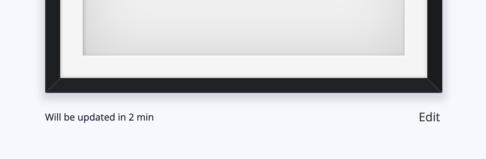

The [paperlesspaper frame](https://paperlesspaper.de/en) does not stay connected to Wi-Fi all the time. Wi-Fi is one of the more energy-expensive parts of the device, so the frame sleeps between update windows to save power.

## Scheduled wake-ups

The frame wakes up during the update periods configured in the device settings. During one of these wake windows, the frame connects to the server, checks whether a newer image is available, downloads it, and updates the display.

Between these configured periods, the frame stays asleep. While it is asleep, it does not keep checking the server in the background.

You can see the next scheduled wake-up time in the app or via [API](api-reference/iotdevice/events/deviceid/get).

## Image generation before the wake-up

Around three minutes before the device is expected to update, paperlesspaper renders the next image from the website and stores it on the server.

This means there can be a short period where the app already shows a newer picture than the one currently visible on the physical frame. The frame will catch up the next time it wakes up and downloads the stored image.

## Manual wake-up

You can wake the frame outside of its scheduled update periods by either:

- pressing the button
- shaking the frame

When you do this, the frame checks the server for a new image and downloads it if one is available.

<Callout type="info" title="Coming soon">
  In the future, pressing the button will also generate a new image. Currently manual wake-up does not generate a new image at that moment. It only looks for an image that has already been rendered and stored on the server.

</Callout>

## More information

- [Blog post on the energy consumption of e-ink frames](https://paperlesspaper.de/en/blog/low-power-devices)
- [Background information on Energy consumption](https://www.reddit.com/r/eink/comments/1f4v965/new_spectra_6_has_great_quality_and_colors_is_it/)
