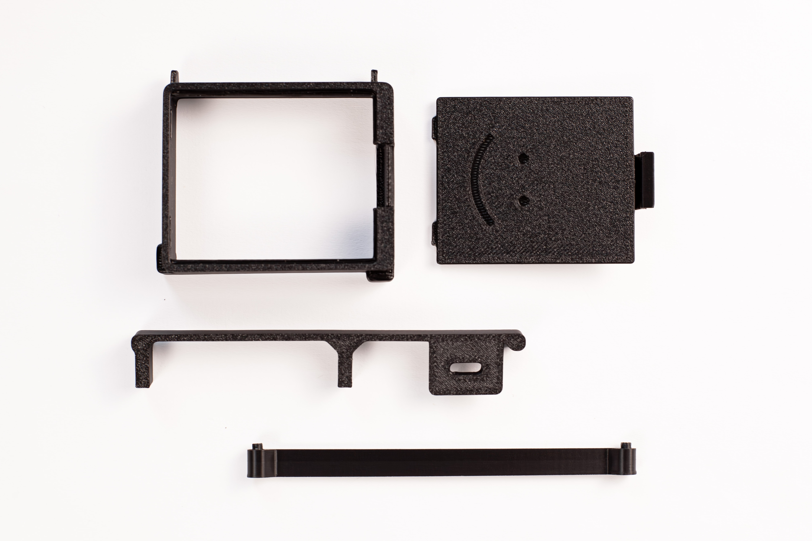
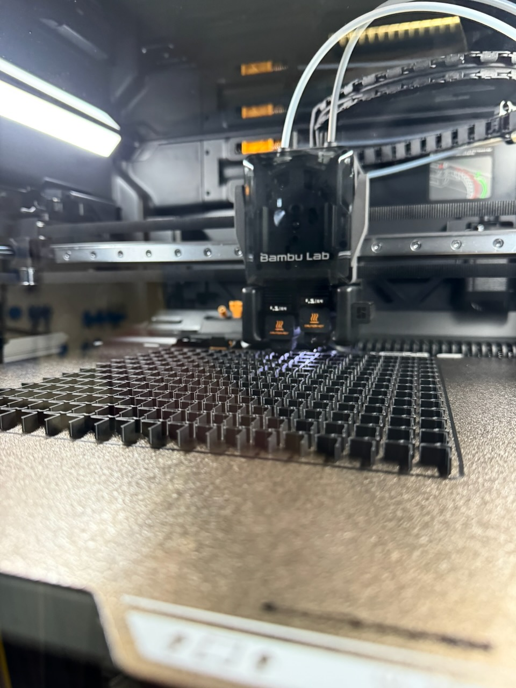
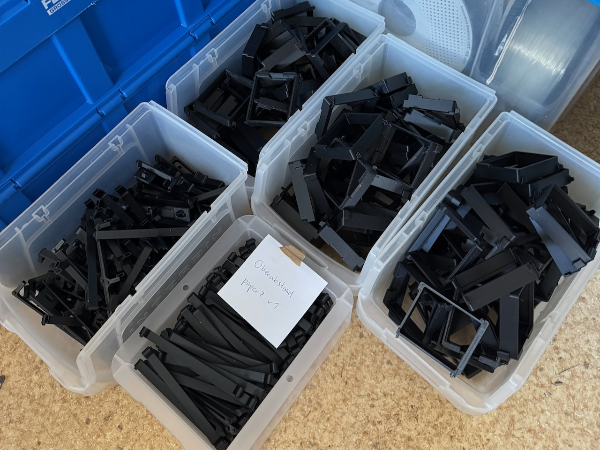

We use black [PETG-HF](https://eu.store.bambulab.com/de/products/petg-hf). PLA is fine for quick test prints, but PETG is the better choice for finished devices.

## Starting settings

- 0.2 mm layer height
- at least 3 walls
- 20–30% infill
- supports where needed

Use the profile included with the model when there is one. The current OpenPaper 7 files are in the [hardware repository](https://github.com/paperlesspaper/paperlesspaper-hardware/tree/main/paper7).

## Parts

- upper spacer
- USB-C/lower spacer
- battery compartment
- flat battery cover
- battery-cover latch

Let the build plate cool before removing the parts. Remove all support material from the battery compartment, latch, hooks, spacers, and cable openings. Test the cover before gluing it.

## Glue the battery cover

Use waterproof cyanoacrylate super glue, not spray adhesive. Work over a piece of cardboard and follow the safety instructions on the glue.

1. Lay out 10–20 covers.
2. Put a small amount of glue on each cover.
3. Insert the latch and press it down.
4. Press it again after about 2 minutes if needed.
5. Leave it for at least 5 minutes.
6. Check that the latch holds and no glue came out at the sides.
