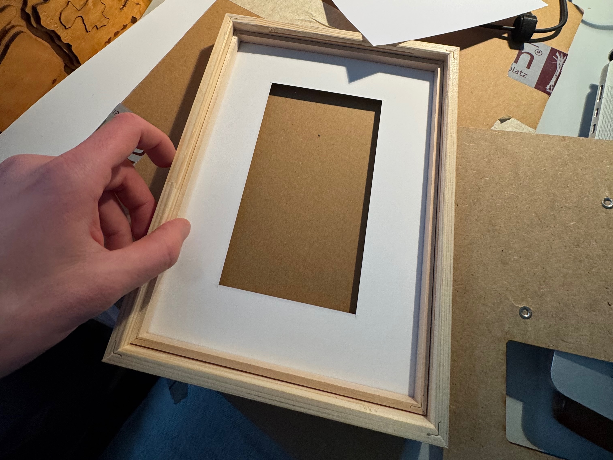

We do recommend picture frames from either [Nielsen](https://www.nielsen-design.de) or [Döhnert Bilderrahmen](https://www.doehnert-rahmen.de), which are widely available in Europe.

They have a good quality, are made from wood and come in the right sizes for paperlesspaper. Look for frames with a depth of at least 20mm to fit the electronics and backplane.

The frames we use for the [OpenPaper 7](https://paperlesspaper.de/buy-7-inch-epaper-picture-frame) are:

#### Nielsen

- Artikel: `0A30N2-006-ESNL`
- Profil : `A30`
- Format: `18,0 x 24,0 cm`
- Leiste: `930520`
- Distanz: `930510`
- Farbe: `Esche Natur lasiert`
- Farbe: `Linde Schwarz deckend`

#### Döhnert

- `MO1530A11` Wechselrahmen 18x24 M-GL
- `EPPKNW4015` Design: 1001 A : 18x24 I: 9,5x16 ex. natur

### Glass

Make sure to use high quality glass for reduced reflections and better visibility of the e-ink display. Some frames come with acrylic instead of glass, which is lighter but can scratch more easily.
We recommend at least UV70 glass.
Usually the glass ist also the highest price point.

#### Assembly (opening the frame)

1. Remove the back of the frame and take out the cardboard insert.
2. Clean the glass with a microfiber cloth to remove dust and fingerprints.

#### Assembly (inserting the passepartout and display)

When closing the frame, make sure the clamps are thightly secured to avoid going out.
