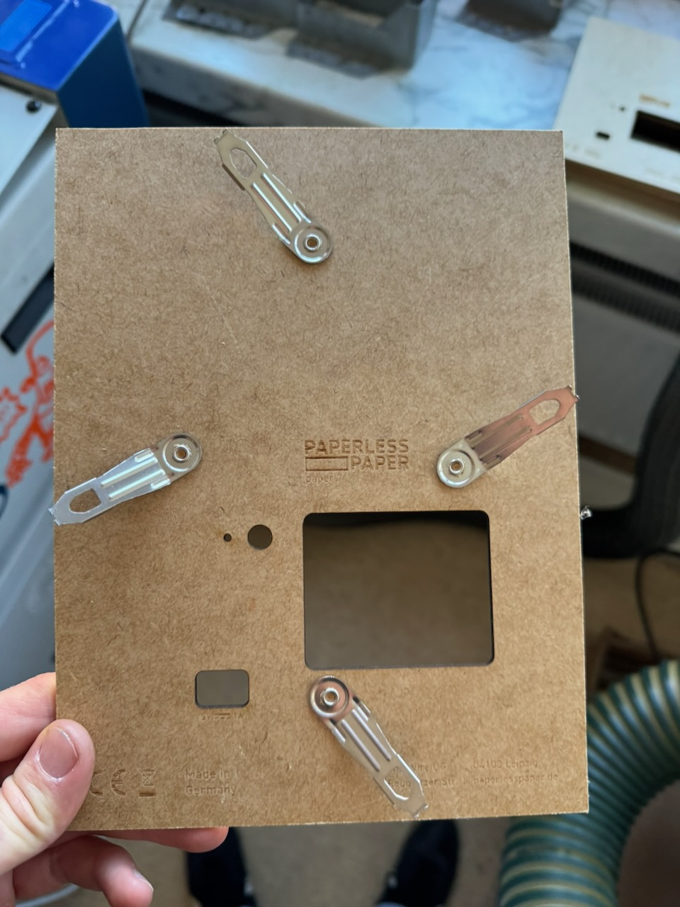
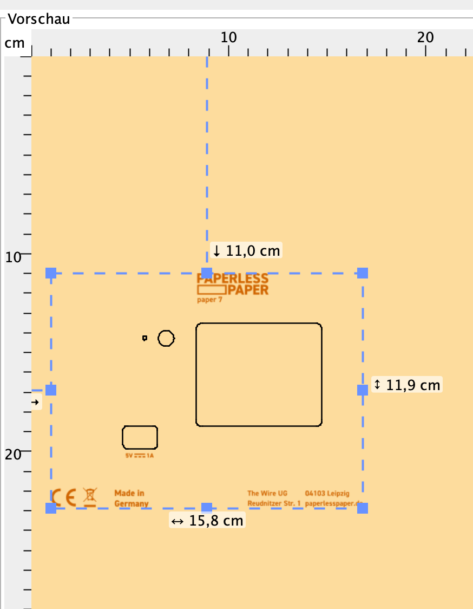
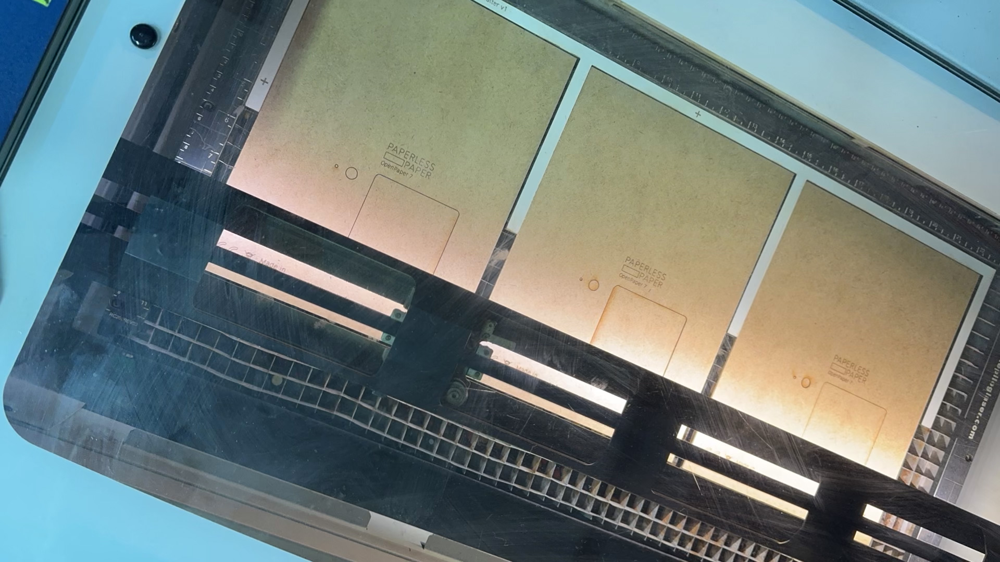
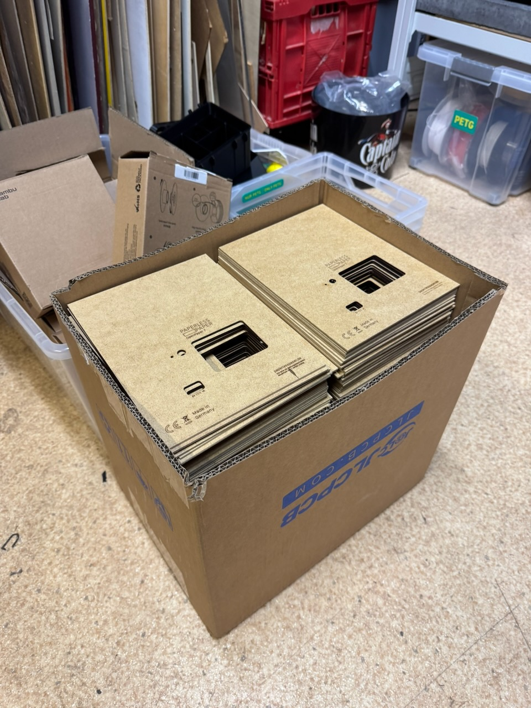

The backplane is made from 2 mm pressboard. Cut and mark it before adding clips or other hardware.

[OpenPaper 7 laser files](https://github.com/paperlesspaper/paperlesspaper-hardware/tree/main/paper7/lasercut)

## Colors

- red: cut
- black: mark
- green: ignore

Use `mark` rather than `engrave` for the text. It is faster and looks cleaner.

## Steps

1. Set the Z distance.
2. Align the X and Y axes.
3. Open the file in [VisiCut](https://visicut.org).
4. Check the cut and mark settings.
5. Make one test backplane.
6. Check that every cut goes through and the text is easy to read.
7. Adjust the settings before cutting the batch.

<Callout type="tip" title="Check the kerf">
  The laser removes a little material around every line. Measure a test piece
  before cutting a full batch, especially after changing material.
</Callout>

## Our settings

These are starting points for our machines. Test them before running a batch.

| Machine | Cut | Mark |
| --- | --- | --- |
| Lasersaur | 100% power, 25% speed, 500 PPI | 4% power, 25% speed, 500 PPI |
| Zing | 100% power, 25% speed, 500 PPI | 15% power, 100% speed, 500 PPI |

For the Zing, use `NEAREST` as the cut order.

## Cutting several at once

A simple jig keeps the pressboard in the same place for every run.

| | Lasersaur | Zing |
| --- | --- | --- |
| OpenPaper 7 | 12 pieces, about 15 minutes | 3 pieces, about 3 minutes |
| OpenPaper L | 6 pieces, about 10 minutes | 2 pieces, about 3 minutes |

Check that the finished backplane is flat, not badly scorched, and fits the frame, USB-C port, buttons, and battery cover.
