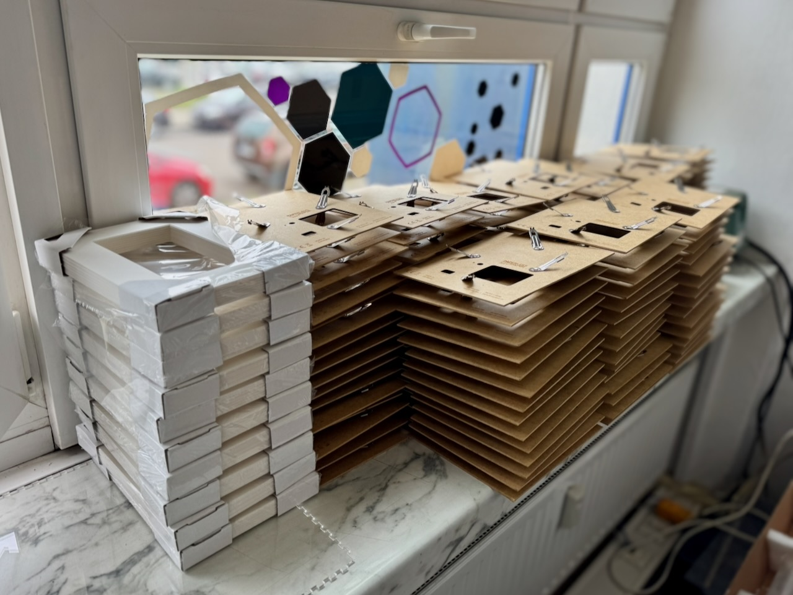

import { GithubInfo } from "fumadocs-ui/components/github-info";

The hardware is designed to be repairable, adaptable, and buildable with accessible tools.

<GithubInfo owner="paperlesspaper" repo="paperlesspaper-hardware" />

This section collects the practical notes for producing printed parts, laser-cut pieces, and finished frames.

<Callout type="info" title="Work in Progress">
  The manufacturing docs are just starting out. Expect printable files, laser
  files, recommended profiles, and assembly notes to grow over time.
</Callout>

Use this area for guidance around the physical hardware:

- [3D printing](/manufacturing/3d-print): printable parts, filament choices, slicer settings, and inserts
- [Laser cutting](/manufacturing/laser): sheet materials, cut files, engraving, and tolerances
- [Frames](/manufacturing/frames): finished frame assemblies, fit checks, and part replacement

