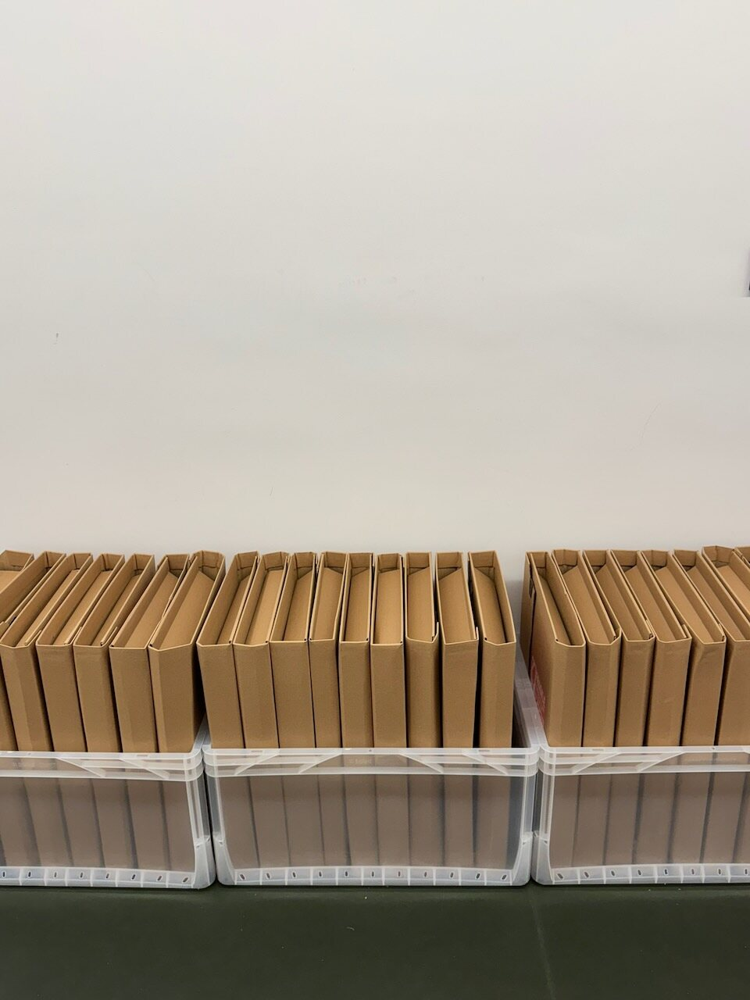
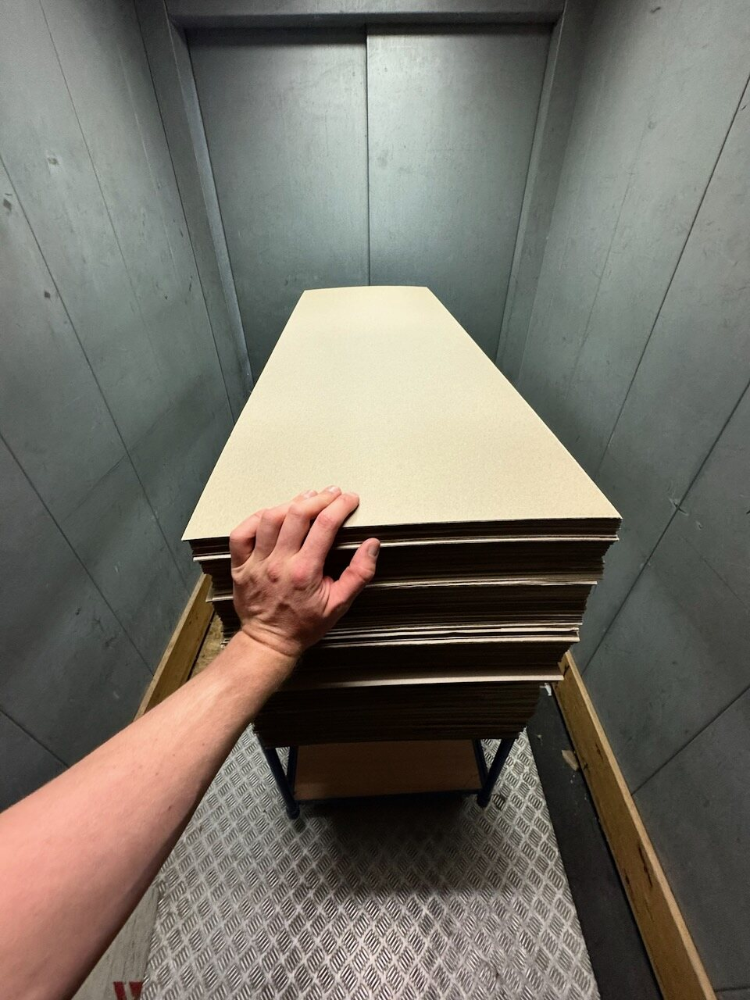
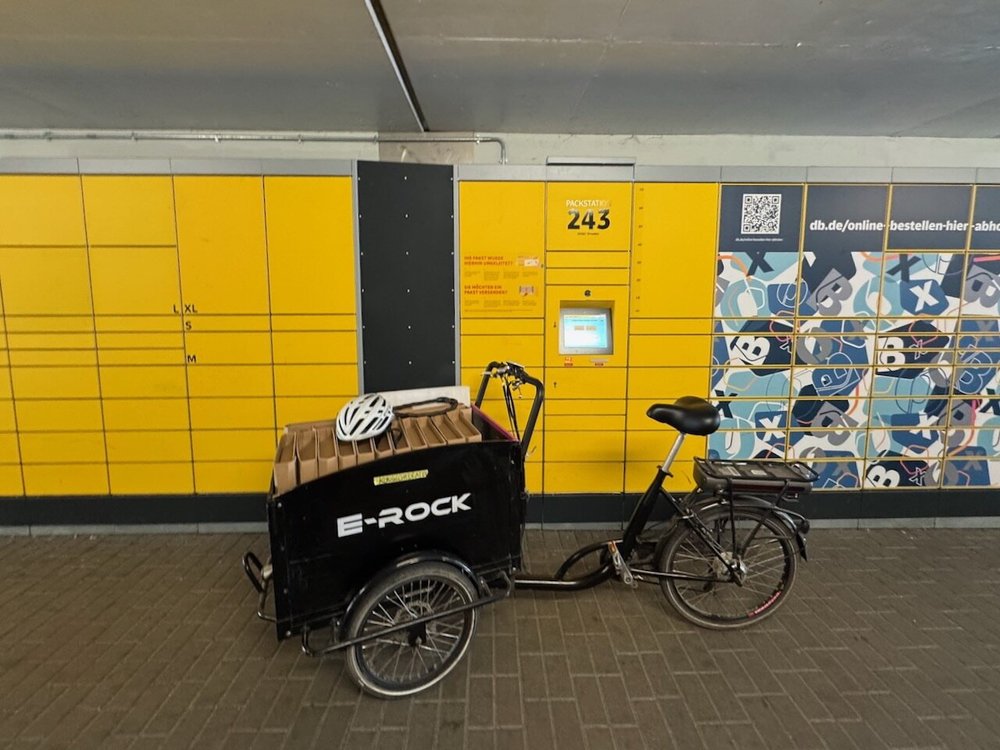
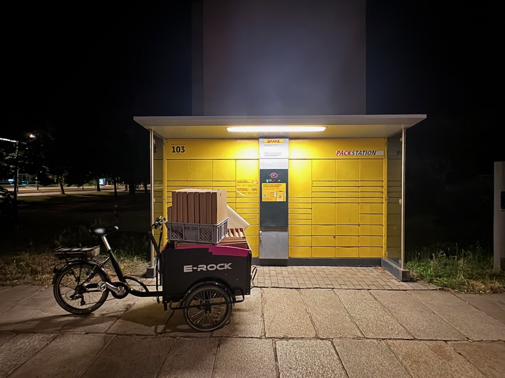

## Prepare the packing station

Keep these materials at the packing station:

- the packing tablet, with the shipping application open
- a USB-connected label scanner
- the correct shipping boxes for OpenPaper 7 and OpenPaper L
- protective paper, padding, and the 13-inch inlay
- A5 welcome flyers and A6 setup flyers
- prepared battery sets, when they may be shipped
- shipping labels, fragile stickers, and any required customs documents

## Choose the package

Use the smallest package intended for the complete order. The packing application shows when an order with several items needs a larger box.

| Order | Package used |
| --- | --- |
| 1 × OpenPaper 7 | [284 × 244 × 0–70 mm variable-height book mailer](https://www.karton.eu/284x244x0-70-mm-Buchverpackung-DHL-Kleinpaket) |
| 2 × OpenPaper 7 | OpenPaper 7 two-unit package |
| 5 × OpenPaper 7 | OpenPaper 7 five-unit package |
| 1 × OpenPaper L | [455 × 325 × 0–80 mm A3 variable-height book mailer](https://www.karton.eu/455x325x0-80-mm-A3-Buchverpackung) |
| 5 × OpenPaper L | OpenPaper L five-unit package |

The single-unit book mailers fold to the height of their contents. Do not overfill them or force the frame into a smaller box. For mixed orders, follow the size shown in the packing application and make sure every item can be padded on all sides.

### 13-inch inlay

The 13-inch OpenPaper L uses a **40 × 120 cm protective inlay**. Include one inlay with each OpenPaper L frame.

## Put in the box

- finished frame, wrapped in paper
- A5 welcome flyer
- A6 setup flyer
- batteries when the shipping service allows them
- padding behind and around the frame
- one 40 × 120 cm inlay for each OpenPaper L

OpenPaper 7 uses 4 × AAA batteries. OpenPaper L uses 4 × AA batteries.

<Callout type="warn" title="Batteries">
  Battery rules depend on the battery type, carrier, and destination. Check the
  current rule for each shipment. Leave the batteries out when unsure.
</Callout>

## Pack the order

1. Connect the scanner by USB and open the shipping application on the packing tablet.
2. Scan the shipping label. Check the customer, device model, frame color, order quantity, and package contents shown on the tablet.
3. Collect every item before packing. For an order with several frames, confirm that the larger package shown in the application is available.
4. Scan the QR code on each display. The application advances to the next order item after every successful scan.
5. Wrap each frame in protective paper. For OpenPaper L, add its 40 × 120 cm inlay.
6. Place the frame in the middle of the box with padding behind and around it. Any pressure must be applied to the back of the frame, never to the display surface.
7. Add one A5 welcome flyer and one A6 setup flyer to the parcel. Add the correct battery set for each frame when batteries may be shipped.
8. Fill every gap so that frames cannot touch each other or the outside of the box. Nothing should move when the open box is shifted gently.
9. Close the box without compressing the display. Attach the shipping label to a flat face and add fragile stickers to the front and back. Add the customs documents required for shipments outside the EU.
10. Scan the shipping label again. The application marks the packing step as complete.

## Final check

Before handing over the parcel, confirm that:

- the frame model, color, and quantity match the order
- every display QR code was scanned
- the display surface has no direct pressure on it
- the flyers and permitted batteries are included
- the parcel does not rattle or slide when moved gently
- the shipping label is readable and customs documents are present when required
- the final shipping-label scan completed the order in the packing application

