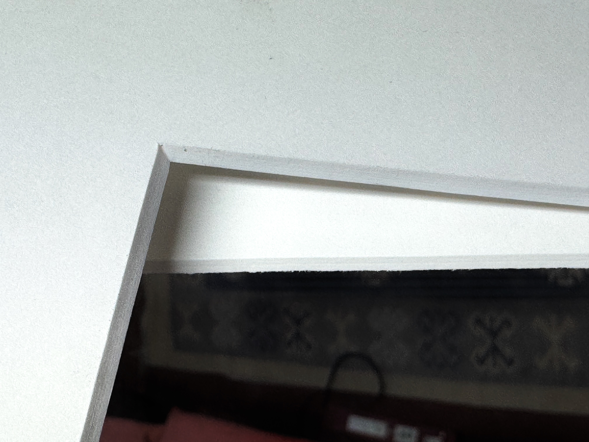

The passepartout is the inner border of the frame that surrounds the e-ink display.

### Size and material

#### OpenPaper 7

- Cutout: 159mm \* 95mm
- Material: 1mm white cardboard
- Display: 160mm \* 96mm

#### OpenPaper L

- Cutout: 200mm \* 268mm
- Material: 1mm white cardboard

