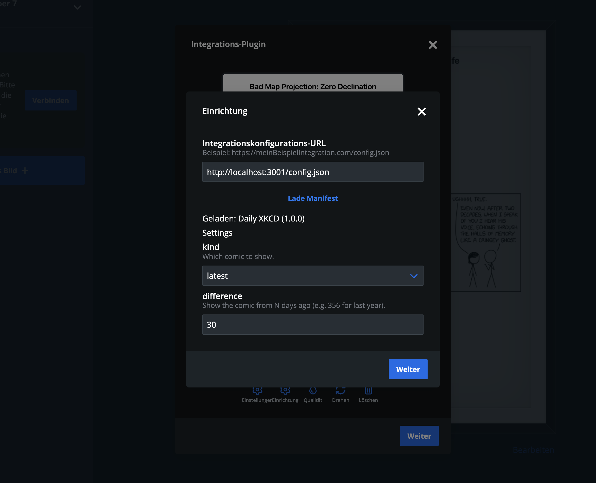

import { GithubInfo } from "fumadocs-ui/components/github-info";
import { File, Folder, Files } from "fumadocs-ui/components/files";
import { Step, Steps } from "fumadocs-ui/components/steps";

<GithubInfo owner="paperlesspaper" repo="openintegration-xkcd" />

`openintegration-xkcd` is a small sample provider built with static HTML and a serverless API route. You can build this shape by hand, with any static host, or with the optional [Open Integration Toolkit](/open-integration/toolkit).

A typical integration includes:

<Files>
  <File name="config.json (static manifest)" />
  <File name="render.html (screenshot target)" />
  <Folder name="languages">
    <File name="de.json" />
    <File name="en.json" />
  </Folder>
  <Folder name="api">
    <File name="data.js (optional data adapter)" />
  </Folder>
  <Folder name="assets">
    <File name="icon.png" />
  </Folder>
</Files>

Use this approach when the integration is mostly a single rendered page with a tiny amount of server logic.

## Local development workflow

For the [XKCD](https://xkcd.com/) sample, the deployed install URL is `https://YOURDOMAIN.COM/config.json`.

In the paperlesspaper app, install the integration by pasting the public config URL into the Integration Plugin flow.

## Minimal build checklist

<Steps>
  <Step>
  
### Public URL

Your manifest URL is public and fetchable from the browser.

</Step>
  <Step>
  
### CORS Headers

The manifest returns correct CORS headers.

</Step>
<Step>
  
### Settings and context

The render page receives the `INIT` payload, merges host settings with local defaults, and treats all payload values as untrusted input.

    </Step>

  <Step>
  
### Loading state
  
- the render page exposes `#website-has-loading-element`
- the render page exposes `#website-has-loaded` only after data, fonts, and images are settled

</Step>
  <Step>

### Local checks

Preview the integration locally and check both landscape and portrait layouts. The optional toolkit can automate this with `check` and `render`.

</Step>
  <Step>

Optional: the settings page, if present, follows the iframe message contract

  </Step>
</Steps>
